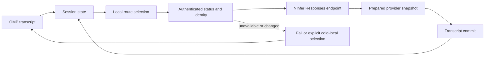

# Local appliance architecture

The appliance is designed for one outcome: long coding sessions stay private and deterministic while local GPU state makes continuation faster. OMP owns durable conversation semantics. NInfer owns acceleration that may be discarded at any time.

## Authority boundaries

| Component | Authoritative for | Not authoritative for |
| --- | --- | --- |
| OMP transcript | User and assistant messages, tool calls/results, branch selection, model-facing replay | GPU cache residency or NInfer process lifetime |
| OMP provider snapshot | Last committed Responses baseline, prior output items, endpoint fingerprint, hashed affinity | The canonical conversation |
| Public appliance registry | Profile capabilities, exact artifact identities, release evidence, installability | A host's active route or secret |
| Private appliance state | Active/fleet installations, rollback target, verified local route | Public release qualification |
| NInfer | Responses execution, private cache, scheduler state, optional durable checkpoints | Transcript recovery policy or model/endpoint fallback |

Provider state is a disposable acceleration layer. If it is absent, stale, corrupt, incompatible, or tied to a different endpoint identity, OMP reconstructs the request from its transcript instead of treating provider state as truth.

## Request flow

A successful turn uses two-phase publication: OMP prepares provider acceleration state, publishes the transcript, then commits the prepared state. Failed or abandoned turns roll it back. That ordering prevents an uncommitted provider response from becoming the baseline for the next turn.

## Exact identity before deltas

Before sending a stateful request, OMP calls the authenticated NInfer status contract and validates the complete schema, served model, deployment profile, runtime/source/config identities, artifact digest, scheduler, cache, MTP, capability, and durability fields. The normalized endpoint and those identities form a SHA-256 endpoint fingerprint.

OMP applies a stable, hashed session identity before computing a chained delta. Each request also gets a distinct hashed request identity. NInfer receives the stable digest in `ninfer_session`; no raw OMP session identifier is sent as the routing identity.

The persisted warm-affinity receipt contains only:

- schema version;
- session SHA-256;
- endpoint fingerprint;
- profile;
- served model;
- artifact SHA-256;
- last successful timestamp;
- an optional enumerated fallback reason.

It contains no base URL, hostname, API key, raw session identifier, prompt, generated text, or private path.

## Fleet selection

OMP evaluates only installations that exactly match an installable public registry profile and a private persisted installation. Each candidate must have:

1. a loopback `/v1` route with no URL credentials, query, or fragment;
2. a readable bearer secret;
3. an authenticated status response matching the promoted artifact and served model;
4. the requested alias, capability, and context window;
5. stateful Responses capability.

Selection then follows these rules:

1. A healthy endpoint whose fingerprint owns the warm session wins.
2. Without affinity, saturated candidates lose to available candidates.
3. Foreground work prefers `rtx5090-linux`; background work prefers `rtx4090-windows`.
4. With foreground reservation enabled, background placement avoids using the RTX 5090 when a compatible RTX 4090 is available.
5. Load breaks remaining ties.

Vision requests filter to a vision-capable profile before placement. Explicit aliases `qwen38-5090` and `qwen38-4090` constrain selection to that profile. Context requests beyond a profile's 131,072-token window are rejected.

## Fail-closed recovery

A warm owner that is unavailable or has changed fails by default. `appliance.coldLocalFallback=true` permits a different healthy, compatible **local** endpoint, records `warm_owner_unavailable`, and rebuilds from the full OMP transcript. It does not enable a cloud provider, different model, or unverified route.

A stale `previous_response_id` receives exactly one full-transcript replay. The retry structurally carries no previous response ID, so it cannot loop as another chained retry. An endpoint identity change clears the old baseline before request construction and also records full replay. See [Session continuation](./session-continuation.md).

## Installation and rollback planes

The data plane is a loopback NInfer Responses endpoint. The control plane is `omp appliance`: host inspection, release planning, verified asset acquisition, isolated candidate startup, qualification, route promotion, status, checkpoints, and rollback.

Promotion never stops the incumbent first. The prior exact installation remains a rollback target until the restored route is proven. Candidate failure before promotion leaves the route unchanged; ambiguous post-promotion recovery preserves runnable candidates and diagnostics rather than deleting the only evidence.

See [Appliance lifecycle](./appliance-lifecycle.md) and [Security and privacy](./security.md).

## Current release boundary

The architecture and registry contracts exist, but both public profiles remain intentionally non-installable. RTX 5090 source provenance is remediated while the image build is held. RTX 4090 K3 stopped at its first restart red; corrected lifecycle/package source and a remediated MTP0 candidate are locally verified, but fresh live qualification and MTP3/K5 are absent. D6 source and host contracts pass, while exact `sm_120a` binary/live proof is blocked on the held RTX 5090 lane. Architecture is not release evidence. Only an exact artifact/config/receipt set can open an install path.
